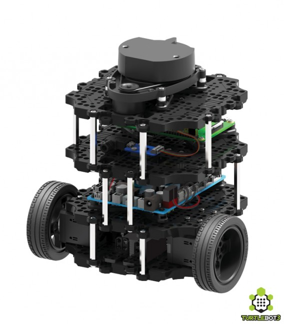
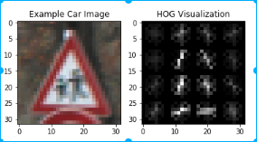
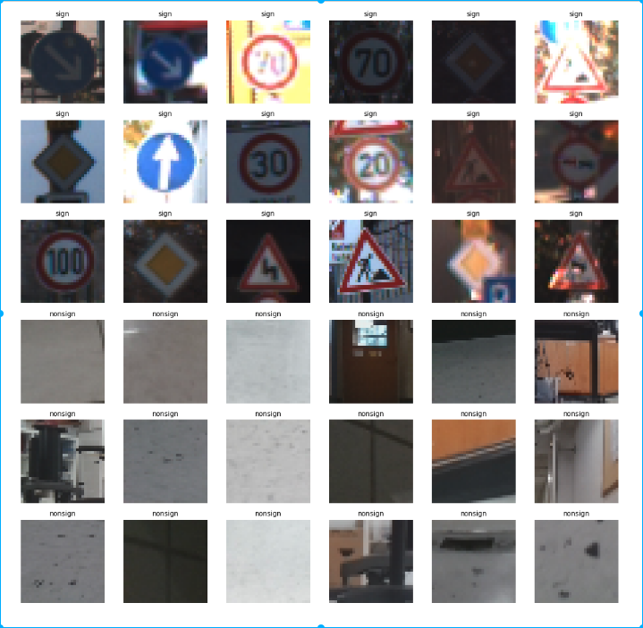
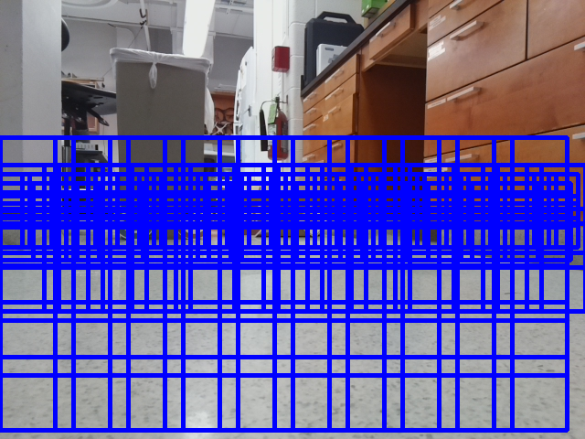
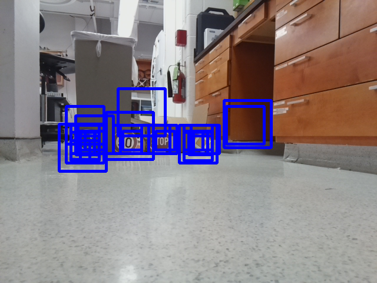
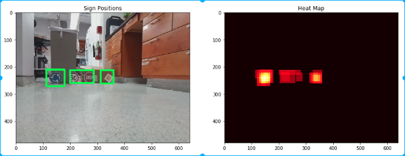
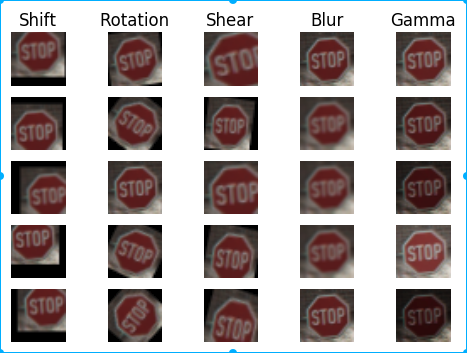
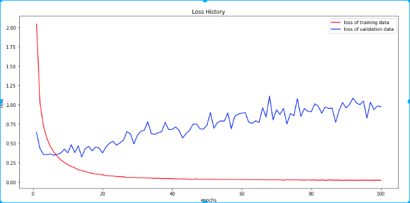

# Self-Driving Turtlebot3 Based on Advanced Lane Line Finding and Traffic Sign Recognition

**I'm still work on this project to fulfill all the functionality of the robot as the project proposal. I'll update any progression of this project on time.**

This project is based on Udacity's self-driving car nanodegree's 3 projects which I finished this term:
- Traffic Sign Classifier Project
- Advan Lane Finding Project
- Vehicle Detection and Tracking Project

## Project Goal
This project is going to build a elementary self-driving robot, which can follow the lane lines and recognize the traffic signs it face to, and thus do corresponding performance.

## Project Setup
The detector dataset is traffic sign sets(labeled 1) and non-traffic signs(labeled 2), with the following characteristics:
* Images are 32 (width) x 32 (height) x 3 (RGB color channels)
* Traffic sign set is composed of 26639 images, non-traffic sign(normal **MSR LAB** images) is composed of 25500 images
* Training set to test set is 0.8 : 0.2

The classifier dataset is plit into training, test and validation sets, with the following characteristics:
* Images are 32 (width) x 32 (height) x 3 (RGB color channels)  
* Training set is composed of 39209 images 
* Validation set is composed of 2526 images
* Test set is composed of 10104 images
* There are 43 classes (e.g. Speed Limit 20km/h, No entry, Bumpy road, etc.)

Moreover, we will be using Python 2.7 with Tensorflow and OpenCV to write our code. And then drive the robot based on ROS platform.

## Project Architecture
**Advanced Lane Finding**
- Camera Calibration and Distortion Correction
- Thresholded binary image based on color transforms and gradients
- Perspective Transform(birds-eye view
- Identifying the lane
- Computing lane’s curvature and center deviation
- PID controller based on curvature and center deviation

**Traffic Sign Detection**
- Detecting Feature Choice
- Building and Training Classifier
- Multi-scale Sliding Windows search
- Multiple Detections & False Positives

**Traffic Sign Classifier**
- Dataset choice and its preprocess
- Deep CNN Architecture
- Dropout
- Data Augment

### Part 1. Advanced Lane Finding
**Ideas Flow:**
I decided to implement a PID controller to make the robot follow the lane lines. To do this, we need to know the robot position relative to the road center. Moreover, we need the curvature of the lane lines to help us control the robot’s steer angle. To get these road data, I decided to get the “birds-eye view” of the road, thus I implement a perspective transform. To find the road area we want to transform, we need detect the lane lines. So I choosed the combination of color and gradient threshold to help me select the lane lines out.

**1. Camera Calibration**
I collected 20 images of chessboard from varying angle and distance served as camera calibration input, feed them into `cv2.findChessboardCorners` to get object points and image points, then feed the result into `cv2.calibrateCamera` to get the Camera Matrix. Here is the result after distortion correction.

**2. Thresholded Binary Image Based on Color Transforms and Gradients**
Firstly, I implement a mask to get the region of road.
The color of two lane lines are black and orange respectively. So I use low L channel in HLS to find black lane, and low B channel in RGB to find orange lane. In addition, to make the land finding mechanism more robust, I implement gradient threshold to filter out nearly vertical or horizontal lines, which are not likely to be lane lines. Here is the thresholded image.

**3. Prespective Transform(birds-eye view)**
Then I implement birds-eye-view transform by choose the transform boundary manually using
`cv2.warpPerspective`

Thus we can see the robot deviation and lane curvature by warped image directly! In addition, I also get the conversion relationship between distance in real world and pixels in warped image by measuring the size of the transform area. **ym_per_pixel** = 22.5/32000; **xm_per_pixel** = 17.5/32000 Which can be used in the following curvature calculation.

**4. Identifying the Lane**
**a. line finding methods: peaks in a histogram**
After applying calibration, thresholding and perspective transform, to decide explicitly which pixels are part of the left lines or right lines, I take a histogram along all the columns in the lower half of the image. Then the two most prominent peaks in the histogram will be good indicators of the x-position of lane lines.

**b. sliding windows search**
I use that as a starting point for where to search for the lines. From that point, I then use a sliding window, placed around the line centers, to find and follow the lines up to the top of the frame. Moreover, after the first several video frame, once we know where the previous lines are, we can search the line for the next frame in a margin around the previous line position, instead of a blind search again.

**5. Measuring Curvature**
**a. fit a second order polynomial curve**
Before we measuring the curvature, we firstly need to use a second(or third, if multiple consecutive turn) order polynomial to fit the points set we get above.

**b. curvature calculation**
I get the curvature by pixel form following formula:

Then according to the pixels to real world factors **ym_per_pixel** = 22.5/32000; **xm_per_pixel** = 17.5/32000, we can get the lane curvature in real world. In addition, we get the robot center deviation by two lanes’ x coordinates.
After the calculation, I implemented an inverse perspective transform to mark the lane lines area.

**6. PID Controller**
The cross-track error’s(CTE) definition just as above show. In this project, the CTE is exactly the same as center offset we figure out. We’ll make CTE and R_Curve served as the input of PID controller. It’s output would be the robot angular velocity.

### Part 2. Traffic Sign Detection
**1. Detecting Feature Choice**
To select the traffic sign out from the lab background, we need to find some image feature which is exclusive to traffic sign. The color components is not doubtedly could be a good indicator, cauze traffic sign usually is a combination of white and blue or red. We can represent by color histogram. Another indicator is the special structure of traffic sign, and we can use histogram of gradient to represent it.

Finally, I choose the combination of color and HOG features to feed the detector.

**2. Building and Training Classifier**
As for the classifier, I choose a linear SVM to classify the traffic sign. Specifically, I’ll train the
model from the [German Traffic Sign Dataset](http://benchmark.ini.rub.de/). It contains more than 20,000 traffic signs image in 32*32*3 size, which label as 1(traffic signs). In addition, I also collect more than 20,000 images in 32*32*3 in **MSR LAB** environment, which label as 0. I keep these two training dataset’s number of image balanced, to make the training result do not biased.

I make 20% of original data as the test data by `train_test_split` in `sklearn.model_selection` module, here is the model performance:

**3. Multi-scale Sliding Windows Search**
Now that we get the classifier, what we’re going to is to implement Multi-scale sliding windows to sample the image’s subregion features, feed them into classifier and make a prediction that whether the subregion contain a traffic sign or not.
Before we implement a brute sliding windows search, here are some tricks about the search windows:
- Considering the robots camera view, which the ground occupy the lower half of the image, we know that traffic sign put on the road would not appear at the higher part of the image. Thus we only implement sliding window search at the lower part of the image.
- Considering traffic signs which are far away from the robot(which are smaller and locate at the center of y axis of the image), we only implement small sliding window at the half of y axis position.

Finally, the sliding window we implement just as follow:

**4. Multiple Detections & False Positives**
After implement multi-scale sliding window search based on our trained classifier, we get the following result:

As we can see, we faced with two problems:
- Multiple positive: multiple windows overlaps on the same traffic sign
- False positive: windows appear on the non-traffic sign region

To overcome this two problems and make our detector more robust, I built a heat-map from these detections in order to combine overlapping detections and remove false positives.

To make a heat-map, I simply add “heat” (+=1) for all pixels within windows where a positive detection is reported by the classifier.

I then adds “heat” to a map for a list of bonding boxes for the detections in images. To remove false positives, I reject areas by imposing a heat threshold. Finally, to figure out how many traffic signs in each video frame and which pixels belong to which traffic sgins, my solution is to use the `label()` funciton. The finally output is as follow:

As we can see, after apply the heatmap, we successfully remove all false positives and combined all multiple positives.(although the middle two traffic signs are combined due to there are nearby each other, we can separate them once the window are far not square.)

### Part 3. Traffic Sign Classifier
This part, I build a deep CNN based on [German Traffic Sign Dataset](http://benchmark.ini.rub.de/) again, which can classifier 43 sort of traffic sign. It’s accuracy arrived at 96.1%.

**1. Dataset Distribution and Its Preprocess**
Before we feed the data into our model to train, we normalized the data, make it locate at the region [-0.5m +0.5], thus can shorten the training time highly.
All 43 traffic sign is as follow:

The distribution of the dataset is as follow:

**2. Deep CNN Architecture**
As for the Convolutional Network structure, I refer [Yann LeCun's this paper](http://yann.lecun.com/exdb/publis/pdf/sermanet-ijcnn-11.pdf). The networks made up with 3 convolutional neural network, has 3*3 kernel, its depth of the next layer double, and has ReLU to serve as activation function. Each CNN has max 2*2 pooling. It has 3 layers of fully-connected layers, and generate 43 result at final layer.

**3. Dropout**
To improve the reliability of the model, I implement dropout algorithm. It can inhibit the model overfitting. According to [this paper](http://jmlr.org/papers/volume15/srivastava14a/srivastava14a.pdf?spm=a2c4e.11153959.blogcont195729.15.79379e375AX56Q&file=srivastava14a.pdf), the author choose different dropout value for different layers. And I decided to implement similar methods, so I define two dropout values: *p-conv* and *p-fc* one is for the CNN, the other is for the fully-connected layers. I choose a more active dropout value when it come to the end of the neural network, that because we don’t want to lose too much information at the beginning of the network. I try several sets of dropout value, finally find *p-conv* = 0.7 and *p-fc* = 0.5 can make my model perform better.

**4.Data Augment**
As we can see in the dataset distribution, 43 sort of data has much unbalanced quantity. This can easily lead our model’s prediction biased to certain sort of model. So I decided to implement data augment to balance the data. Moreover, to make the model more robust, I provide new image in different environment such as translation, rotation, transformation, blur and illuminance. I implement these effect respectively by `cv2.warpAffine` ,`cv2.GaussianBlur` and `cv2.LUT`.
Some example of new data is as follow:

**5. Model Performance**
Here is the loss function value history through 100 training epochs:

From above result, we know that although we get good classifier performance(96.1 %), the validation loss rise slightly as the training loss decrease nearly to zero, which release that our model is a little overfitting.

**6. Performance of Traffic Sign Recognition (Detection & Classification)**
After I fusion the traffic sign detection & classifier together, here is two test image:

**Stretch Goal**
Now I finish all computer vision part of the project, my next step is to fulfill the dynamic control of Turtlebot3 given the real-time the Lane Line data, and corresponding robot behavior based on traffic sign recognition.
